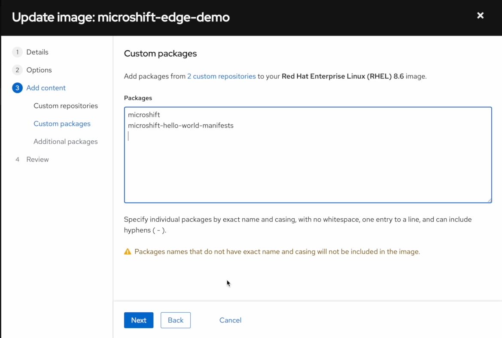
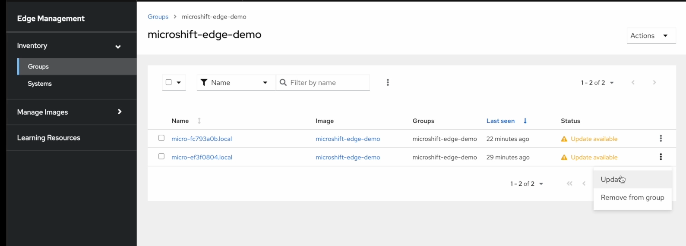

# MicroShift demo on the Edge Management console

This demo will allow you to experience the integration between MicroShift and the [RedHat hosted Edge fleet management](https://console.redhat.com/edge/). At the time of writing this demo, MicroShift is still in development, and it's impossible to bundle the MicroShift package into image builds yet. To make this possible, we use the public test build created by the MicroShift team for the KubeCon NA 2022 [here in copr](https://copr.fedorainfracloud.org/coprs/g/redhat-et/microshift-testing/)

The RedHat Edge Management hosted service allows you to build RHEL4Edge images, and manage a fleet of devices based on those images.

## Pre-requisites
This demo has two requirements:
* A RHEL/Fedora box with mkksiso and rpmbuild installed.
* A RedHat developer account with an OpenShift demo subscription to get access to the image respositories consumed by MicroShift.

## Warning
The Edge Management console is in constant development, and the screenshots we present in the following sections are likely to change over time, at some point MicroShift and related packages should be available right away, or the deployment of MicroShift could have a dedicated UI.

## Demo workflow

### Create a custom repository
Go [here](https://console.redhat.com/edge/).  And create a new custom repository pointing to `https://download.copr.fedorainfracloud.org/results/@redhat-et/microshift-testing/epel-8-x86_64/`


In Manage Images/Custom Repositories add a new one called `microshift-copr-testing` with fhe following BaseURL `https://download.copr.fedorainfracloud.org/results/@redhat-et/microshift-testing/epel-8-x86_64/`


### Create a new Image with MicroShift based on RHEL 8.6


Provide an image name and description


Select RHEL 8.6 as base image.


The interface will request the addition of a user and ssh key, but this will be overriden  later during our custom kickstart injection into the ISO.


Add the custom repository we created on the previous steps.


Request the `microshift` package to be installed.


Review the image details and if everything looks right: Create Image.


After some time (expect 45min), our image should be ready, and we can download the ISO file.


At this point you should download the ISO:


### Inject kickstart and boot
We can then continue to inject the kickstart file using the `run.sh` provided as part of this demo.


You will need:
* The downloaded .iso file as input
* The credentials for having your system registered into the Edge management console
* The pull secret downloaded from https://console.redhat.com/openshift/downloads#tool-pull-secret

```bash
./run.sh microshift-edge-demo.iso rhc_credentials.env .pull_secret microshift-edge-demo-ks.iso
````

This script will generate both `microshift-edge-demo-ks.iso` and `microshift-edge-demo-ks.iso.ks` the kickstart file is embedded into the new iso, the `.ks` file is only provided for informational purposes.

Please be aware that the pull secret and rhc_credentials.env are embedded in the iso, the credentials will be removed from the installed system once the first-boot registration finished.


At this point we can boot our new ISO, once booted the system will register to the
fleet management.


We can login into the system via ssh, with user `redhat`, and our public ssh key, or the `redhat` password.

```bash
ssh redhat@<vm ip>

$ sudo su -
$ ./get-oc.sh
$ oc get pods -A -o wide
$ oc get nodes -o wide
```

We provide a small script to download the right version of the OpenShift client (4.12 EC4 at this time), and the KUBECONFIG is pointed to `/var/lib/microshift/resources/kubeadmin/kubeconfig` on the root user `.profile` file.

### Create a new version of the image, and update the system
We can update our image with new content afterwards, and get the connected system upgraded when the new image is ready.

In the following example we install a small application set of manifests in `/usr/lib/microshift/manifests`. The manifests start a small hello world web server based in nginx, and expose the service via a `hello-world.local` route.


## Updating the system to run an application in MicroShift

MicroShift consumes manifests provided in `/etc/microshift/manifests` and `/usr/lib/microshift/manifests/` the first directory is meant for day-2 management systems, while the `/usr/lib` path can be used to embed manifests into the ostree images without having the risk of those manifests being modified at runtime.

For the purpose of the demo we have created a small repository in `https://copr.fedorainfracloud.org/coprs/mangelajo/microshift-hello-world/` that contains the manifests of our demo. You can create your own repository with your own manifests in copr if you register to [copr.fedorainfracloud.org](https://copr.fedorainfracloud.org), where you can create a project, and upload the manifests srpm.

To create the `srpm` use the provided `create-manifests-srpm.sh`:
```bash
[majopela@lenovo demo]$ ls manifests/
kustomization.yaml  microweb-mdns.yaml  microweb-ns.yaml  microweb-service.yaml  microweb.yaml
```

```bash
[majopela@lenovo demo]$ ./create-manifests-srpm.sh
Creating manifests tarball
Creating SRPM
setting SOURCE_DATE_EPOCH=1666828800
Wrote: /home/majopela/rpmbuild/SRPMS/microshift-hello-world-manifests-1.0.0-1.src.rpm
Wrote ./microshift-hello-world-manifests-1.0.0-1.src.rpm
Done
```

But you don't need to create this repositoy if you want and simple use the pre-created one in [https://copr.fedorainfracloud.org/coprs/mangelajo/microshift-hello-world/](https://copr.fedorainfracloud.org/coprs/mangelajo/microshift-hello-world/).

### Create a new version of the image with the manifests

Add the new manifests repository to the image manager


Create a new version of the image


Add the `microshift-manifests-example` repository to the image


Add the new `microshift-manifests-example` package to the image.



Continue with the process, and eventually your new image version will be built, you only
need the ostree tar layer, not the iso. You can always build the iso if you want to install new systems with the application available right away, but build time is longer; remember to inject the kickstart if you do that.


You can proceed to update the running system at this point.



The update can be monitored in the running system by running:
```bash
$ journalctl -u rhcd -u rpmostreed -f
```

Please note that this operation once triggered will take some time, as the
edge management system will prepare and extract the ostree to be
exposed via https to the instances.

Once the system has updated and rebooted, if you login and (as root) use oc,
you can see the new application running in the `microweb` namespace.


And you can connect to the application via a route on http://hello-world.local


Please note that if the system where your browser is running does not resolve
mdns, you will need to add the ip address of the MicroShift instance to your
local /etc/hosts, or to your DNS servers. i.e.:

```bash
echo 192.168.100.12 hello-world.local >>/etc/hosts
```

